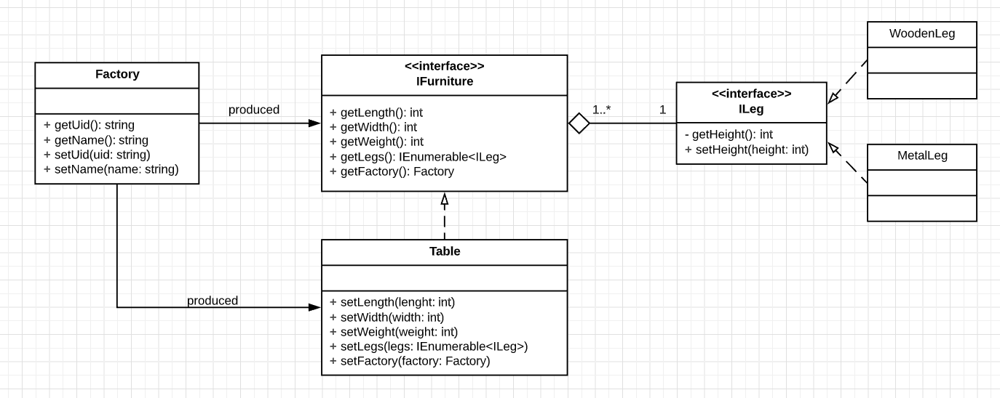

# Домашнее задание 1

Создать UML-диаграмму на основании кода. 

*Здесь есть опечатка. Метод getHeight() в интерфейсе ILeg должен быть public, т.е. +*.

https://www.lucidchart.com/documents/view/51370a10-2d4a-4f21-9463-da7d9e3662b1/0_0

